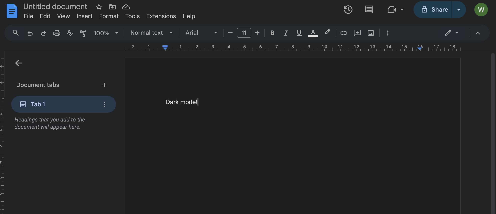
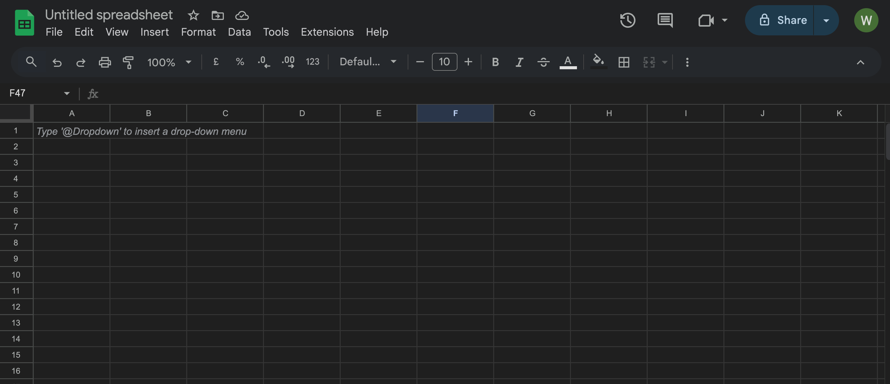
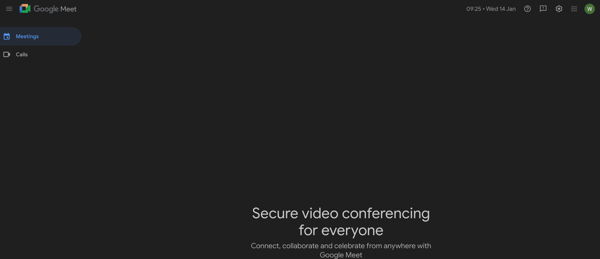

# Google Dark Mode

A browser extension that applies dark mode to Google Docs, Sheets, and Meet based on your system settings.

## Screenshots

## Features

- Automatically follows macOS system dark/light mode
- Manual override: force dark mode on or off
- Works on Google Docs, Sheets, and Meet
- Minimal, non-invasive design

## Install

1. Clone or download this repository
2. Open Chrome or Brave and navigate to `chrome://extensions`
3. Enable **Developer mode** (toggle in top right)
4. Click **Load unpacked**
5. Select the `google-docs-dark-mode` folder
6. The extension icon will appear in your toolbar

## Usage

Click the extension icon to toggle between:

- **System** - Follows your macOS appearance setting
- **On** - Always use dark mode
- **Off** - Always use light mode

## Supported Sites

- `docs.google.com` (Docs, Sheets, Slides)
- `meet.google.com`
